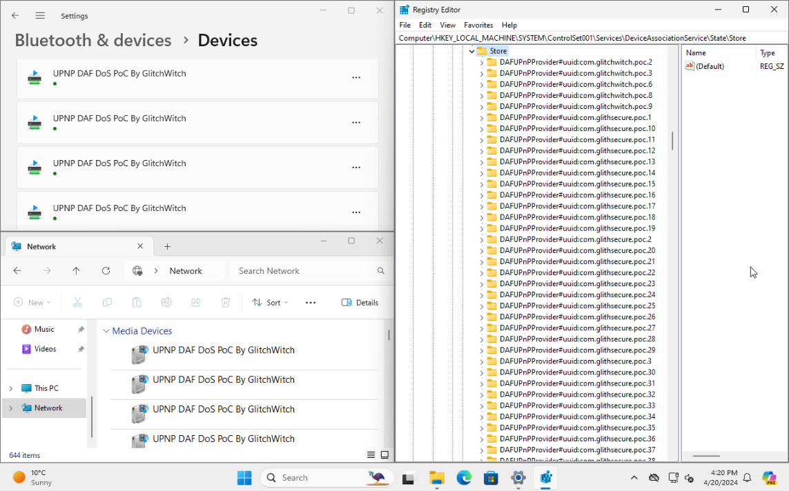

# Device Association Framework (DAF) Denial of Service Proof of Concept.

Inspired by this post: https://cohost.org/ghoulnoise/post/5286766-do-not-buy-hisense-t

This is a quick and dirty PoC that utilises [simple-upnpd](https://github.com/victronenergy/simple-upnpd) to reproduce the issue described in @ghoulnoise's post.

This is done by repeatedly broadcasting devices with incrementing (and invalid) UUIDs, these devices are then automatically added to Device Association Framework on any Windows system's on the same network that have "Private Network" and "Set up network connected devices automatically" enabled.


## Usage

Step 1. Install the dependencies

```
sudo apt-get install git libgupnp-1.2-1
```

Step 2. Clone this repo

```
git clone https://github.com/GlitchWitch/upnp-daf-dos-poc.git
```

Step 3. Run the script

```
cd upnp-daf-dos-poc
./poc.sh
```

Step 4. ???

Step 5. Visit Settings->Bluetooth & devices->Devices or `Computer\HKEY_LOCAL_MACHINE\SYSTEM\ControlSet001\Services\DeviceAssociationService\State\Store` and note the newly created devices.


